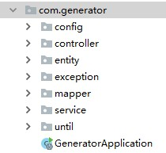
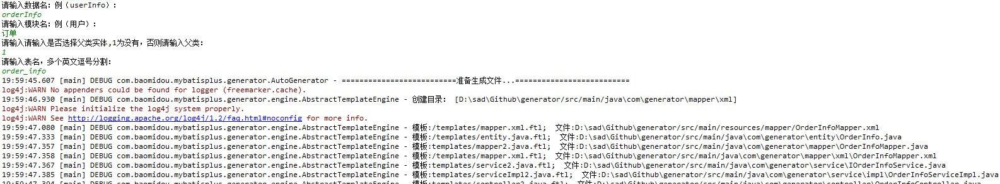

这篇文章第一部分讲解Mybatis-plus的使用。点下面的链接可前往官网。

**但要注意的是。使用它仅是为了快速开发，因为sql优化的第一点就是sql语句里的select 不应直接写 * 也就是查找全部，而是应该写上为一个要用的字段。**

第二部分写Mybatis-plus里的代码生成器，首先代码生成的代码实际上直接用[Mybatis-plus](https://mp.baomidou.com/guide/generator.html)官网里的范例就可以了，但要把生成的代码变成自己想要的样子，还是需要自己修改模板代码，所以这篇文章会展示出我现在使用的模板。

## 文章目录：

1. Mybatis-Plus 使用
2. 代码生成器

## Mybatis-Plus使用

**pom.xml 中所需添加的依赖**

```java
        // Mybatis-Plus的包
		<dependency>
            <groupId>com.baomidou</groupId>
            <artifactId>mybatis-plus-boot-starter</artifactId>
            <version>3.3.1.tmp</version>
        </dependency>
        // 代码构造器的包
        <dependency>
            <groupId>com.baomidou</groupId>
            <artifactId>mybatis-plus-generator</artifactId>
            <version>3.3.1.tmp</version>
        </dependency>
        // 使用的模板是freemarker
        <dependency>
            <groupId>org.freemarker</groupId>
            <artifactId>freemarker</artifactId>
            <version>2.3.30</version>
        </dependency>
        // lombok的包，建议下载插件，不下载插件代码会带红，但可以运行
        <dependency>
            <groupId>org.projectlombok</groupId>
            <artifactId>lombok</artifactId>
            <optional>true</optional>
        </dependency>
        // 使用pagehelper来分页，Mybatis-plus有分页的Api，使用与否看自己
        <dependency>
            <groupId>com.github.pagehelper</groupId>
            <artifactId>pagehelper-spring-boot-starter</artifactId>
            <version>1.2.10</version>
        </dependency>
        // 如果打算使用swagger添加下面两个注解
        <dependency>
            <groupId>io.springfox</groupId>
            <artifactId>springfox-swagger2</artifactId>
            <version>2.9.2</version>
        </dependency>
        <dependency>
            <groupId>io.springfox</groupId>
            <artifactId>springfox-swagger-ui</artifactId>
            <version>2.9.2</version>
        </dependency>
```

**项目结构 其中exception，config，until不是涉及这篇教程**

<figure>
	<a href="../assets/img/picture/Snipaste_2020-04-29_18-53-53.jpg"></a>
</figure>

**Application.java**

```java
@EnableCaching
// 扫描mapper文件夹
@MapperScan("com.generator.mapper")
@SpringBootApplication
public class GeneratorApplication {

    public static void main(String[] args) {
        SpringApplication.run(GeneratorApplication.class, args);
    }

}
```

**实体类entity**

```java
@Data
// 这个如果是true的话在equal时要考虑其父类，因为这个类是没父类的所以为false
// 我建议这个地方大家去了解以下，和equals()这个方法有关，涉及到父类与子类的.equals()
@EqualsAndHashCode(callSuper = false)
@Accessors(chain = true)
//下面这个注解是swagger的
@ApiModel(value="UserInfo对象", description="")
public class UserInfo implements Serializable {

    private static final long serialVersionUID = 1L;
	// 下面这个是Mybatis-Plus的注解，主键声明，自动增长
    @TableId(value = "user_id", type = IdType.AUTO)
    private Integer userId;

    private String pwd;

    private String userName;

    private String userRealName;

    private String telephone;
    // swagger注解
    @ApiModelProperty(value = "用户职业")
    private String userPro;


}
```

**service包下的**

```java
// 此处需要继承IService<Entity>，来获得Mybatis-plus里的方法。
// 这里其实是可以不用写下面这些，因为Mybatis-plus内部就有相应的select这些方法，相关请自己看官方文档
// 但我还是建议用自己设计的方法，可调用性更高
public interface IUserInfoService extends IService<UserInfo> {

    /**
     * 查找 userInfo
     * @param userInfo
     * @param pageStart
     * @param pageSize
     * @return
     */
    List<UserInfo> findUserInfo(UserInfo userInfo, Integer pageStart, Integer pageSize);

    /**
     * 添加 userInfo
     * @param userInfo
     * @return
     */
    int insertUserInfo(UserInfo userInfo);

    /**
     * 修改 userInfo
     * @param userInfo
     * @return
     */
    int updateUserInfo(UserInfo userInfo);

    /**
     * 删除 userInfo
     * @param id
     * @return
     */
    int deleteUserInfo(int id);

}
```

**service包里的impl文件夹下**
```java
// 声明是一个Service服务类，继承ServiceImpl<Entity>使用Mybatis-plus里的方法，实现IUserInfoService里声明的接口
@Service
public class UserInfoServiceImpl extends ServiceImpl<UserInfoMapper, UserInfo> implements IUserInfoService {

    @Autowired
    private UserInfoMapper userInfoMapper;

    @Override
    public List<UserInfo> findUserInfo(UserInfo userInfo, Integer pageStart, Integer pageSize) {
        /*
        这个是调用QueryWrapper里的 eq 这类的方法来自己构建一个sql语句
        QueryWrapper<UserInfo> queryWrapper=new QueryWrapper<>();
        queryWrapper.eq("userName",userInfo.getUserName());
        */
        // 使用QueryWrapper条件构造器，此处是将对象直接存入，还有别的使用方法，里面直接根据情况调用eq这些api命令
        QueryWrapper<UserInfo> queryWrapper=new QueryWrapper<>(userInfo);
        // 使用pagehelper来分页
        PageHelper.startPage(pageStart,pageSize);
        // 调用ServiceImpl里的selectList方法
        return userInfoMapper.selectList(queryWrapper);
    }

    @Override
    public int insertUserInfo(UserInfo userInfo) {
        return userInfoMapper.insert(userInfo);
    }

    @Override
    public int updateUserInfo(UserInfo userInfo) {
        return userInfoMapper.updateById(userInfo);
    }

    @Override
    public int deleteUserInfo(int id) {
        return userInfoMapper.deleteById(id);
    }


}
```

**mapper文件夹下**

```java
// 声明是一个接口,继承BaseMapper<Entity>
@Repository
public interface UserInfoMapper extends BaseMapper<UserInfo> {
    // 此处加自定义的mapper
}
```

**resources下的mapper文件夹**

```xml
<?xml version="1.0" encoding="UTF-8"?>
<!DOCTYPE mapper PUBLIC "-//mybatis.org//DTD Mapper 3.0//EN" "http://mybatis.org/dtd/mybatis-3-mapper.dtd">
<mapper namespace="com.generator.mapper.UserInfoMapper">

</mapper>
```

**controller文件夹下**

```java
// swagger注解
@Api(tags = "UserInfoController", description = "用户管理")
@RestController
@RequestMapping("/user-info")
public class UserInfoController {

    //这里我是以接口来声明一个变量，可直接使用service来声明
    @Autowired
    private IUserInfoService userInfoService;
    
    // swagger注解
    @ApiOperation("查询用户")
    @RequestMapping(value = "/list", method = RequestMethod.GET)
    public RespBody findUserInfo(UserInfo userInfo,
                                 @RequestParam(value = "pageStart",defaultValue = "1")Integer pageStart,
                                 @RequestParam(value = "pageSize", defaultValue = "10")Integer pageSize){
        List<UserInfo> userInfoList = userInfoService.findUserInfo(userInfo, pageStart, pageSize);
        // pagehelper的返回类
        PageInfo<UserInfo> pageInfo = new PageInfo<>(userInfoList);
        return RespBody.ok(pageInfo);
    }

    @ApiOperation("添加用户")
    @RequestMapping(value = "/insert", method = RequestMethod.POST)
    public RespBody insertUserInfo(UserInfo userInfo) {
        int result = userInfoService.insertUserInfo(userInfo);
        if (result == 1) {
            return RespBody.ok();
        }
        return RespBody.error();
    }

    @ApiOperation("修改用户")
    @RequestMapping(value = "/update", method = RequestMethod.POST)
    public RespBody updateUserInfo(UserInfo userInfo) {
        int result = userInfoService.updateUserInfo(userInfo);
        if (result == 1) {
            return RespBody.ok();
        }
        return RespBody.error();
    }

    @ApiOperation("删除用户")
    @RequestMapping(value = "/delete", method = RequestMethod.POST)
    public RespBody updateUserInfo(@RequestParam("id")int id) {
        int result = userInfoService.deleteUserInfo(id);
        if (result == 1) {
            return RespBody.ok();
        }
        return RespBody.error();
    }

}
```

**到此，上面就是使用我设计模板生成的相应代码了**

## 我的Mybatis-plus代码生成器

**代码**

```java
// 做出了一些修改，但总体上与官网里的代码相同
public class CodeGenerator {

    /**
     * <p>
     * 读取控制台内容
     * </p>
     */
    public static String scanner(String tip) {
        Scanner scanner = new Scanner(System.in);
        StringBuilder help = new StringBuilder();
        //输入模块名
        help.append("请输入" + tip + "：");
        System.out.println(help.toString());
        if (scanner.hasNext()) {
            String ipt = scanner.next();
            if (StringUtils.isNotBlank(ipt)) {
                return ipt;
            }
        }
        throw new MybatisPlusException("请输入正确的" + tip + "！");
    }

    public static void main(String[] args) {
        // 代码生成器
        AutoGenerator mpg = new AutoGenerator();

        // 全局配置
        GlobalConfig gc = new GlobalConfig();
        String projectPath = System.getProperty("user.dir");
        // 输出的路径
        gc.setOutputDir(projectPath + "/src/main/java");
        // 作者
        gc.setAuthor("dell");
        gc.setOpen(false);
        //  是否使用实体属性 Swagger2 注解
        gc.setSwagger2(true);
        mpg.setGlobalConfig(gc);

        // mysql数据源配置
        DataSourceConfig dsc = new DataSourceConfig();
        dsc.setUrl("jdbc:mysql://localhost:3306/mall?serverTimezone=GMT%2B8&characterEncoding=UTF-8");
        dsc.setDriverName("com.mysql.cj.jdbc.Driver");
        dsc.setUsername("root");
        dsc.setPassword("*****");
        mpg.setDataSource(dsc);

        // 包配置
        PackageConfig pc = new PackageConfig();
        // pc.setModuleName(scanner("模块名")); 示例中有一个输入模块名的步骤，我舍去了
        // 设置前缀名
        pc.setParent("com.generator");
        mpg.setPackageInfo(pc);

        String myName = scanner("数据名：例（userInfo）");
        String myTitle = scanner("模块名：例（用户）"); 
        // 自定义配置
        InjectionConfig cfg = new InjectionConfig() {
            @Override
            public void initMap() {
                // 可看作设置了几个全局量，用于将自己模板生成的描述更好，在模板中的使用方法${cfg.myName}
                Map<String, Object> map = new HashMap<>();
                map.put("myName", myName);
                map.put("myTitle", myTitle);
                this.setMap(map);
            }
        };

        // 如果模板引擎是 freemarker
        String templatePath = "/templates/mapper.xml.ftl";
        // 自定义输出配置
        List<FileOutConfig> focList = new ArrayList<>();
        // 自定义配置会被优先输出
        focList.add(new FileOutConfig(templatePath) {
            @Override
            public String outputFile(TableInfo tableInfo) {
                // 这里是resources里的mapper.xml
                return projectPath + "/src/main/resources/mapper/"
                        + tableInfo.getEntityName() + "Mapper" + StringPool.DOT_XML;
            }
        });

        cfg.setFileOutConfigList(focList);
        mpg.setCfg(cfg);

        // 配置模板
        TemplateConfig templateConfig = new TemplateConfig();
        // 配置自定义输出模板,不写下面的代码就是使用默认的模板输出。
        // 模板位置找到mybatis-plus-generator包打开templates，下面还会有一张图
        templateConfig.setService("templates/service2.java");
        templateConfig.setController("templates/controller2.java");
        templateConfig.setServiceImpl("templates/serviceImpl2.java");
        templateConfig.setMapper("templates/mapper2.java");
        
        // 如果向生成的xml里也有代码设置路径，我没有设置
        templateConfig.setXml(null);
        mpg.setTemplate(templateConfig);

        // 策略配置，骆峰这类的设置
        StrategyConfig strategy = new StrategyConfig();
        strategy.setNaming(NamingStrategy.underline_to_camel);
        strategy.setColumnNaming(NamingStrategy.underline_to_camel);

        //选择是否有父类实体
        String ipt = scanner("请输入是否选择父类实体,1为没有，否则请输入父类");
        if (!("1".equals(ipt))) {
            //设置父类实体
            strategy.setSuperEntityClass(ipt);
        }

        // 是否使用Lombok的方式
        strategy.setEntityLombokModel(true);
        // 是否使用RestController
        strategy.setRestControllerStyle(true);
        //公共父类strategy.setSuperControllerClass("你自己的父类控制器,没有就不用设置!");
        //写于父类中的公共字段
        strategy.setSuperEntityColumns("id");
        
        // 输入相关的名称
        strategy.setInclude(scanner("表名，多个英文逗号分割").split(","));
        strategy.setControllerMappingHyphenStyle(true);
        strategy.setTablePrefix(pc.getModuleName() + "_");
        mpg.setStrategy(strategy);
        mpg.setTemplateEngine(new FreemarkerTemplateEngine());
        mpg.execute();
    }

}
```

**默认模板位置**

<figure>
	<a href="../assets/img/picture/Snipaste_2020-04-29_19-51-34.jpg"></a>
</figure>

**运行示例**

<figure>
	<a href="../assets/img/picture/Snipaste_2020-04-29_20-01-07.jpg"></a>
</figure>

## 最后放上模板代码

**controller2.java.ftl**

```ftl
package ${package.Controller};
// 这个地方请自己改动，改成自己的路径
import com.generator.entity.RespBody;

import com.generator.entity.${entity};
import com.generator.service.${table.serviceName};

import com.github.pagehelper.PageInfo;
import io.swagger.annotations.Api;
import io.swagger.annotations.ApiOperation;
import org.springframework.beans.factory.annotation.Autowired;
import org.springframework.web.bind.annotation.RequestMapping;
import org.springframework.web.bind.annotation.RequestMethod;
import org.springframework.web.bind.annotation.RequestParam;

import java.util.List;

<#if restControllerStyle>
import org.springframework.web.bind.annotation.RestController;
<#else>
import org.springframework.stereotype.Controller;
</#if>
<#if superControllerClassPackage??>
import ${superControllerClassPackage};
</#if>

/**
 * <p>
    * ${table.comment!} 前端控制器
    * </p>
 *
 * @author ${author}
 * @since ${date}
 */
@Api(tags = "${table.controllerName}", description = "${cfg.myTitle}管理")
<#if restControllerStyle>
@RestController
<#else>
@Controller
</#if>
@RequestMapping("<#if package.ModuleName??>/${package.ModuleName}</#if>/<#if controllerMappingHyphenStyle??>${controllerMappingHyphen}<#else>${table.entityPath}</#if>")
<#if kotlin>
class ${table.controllerName}<#if superControllerClass??> : ${superControllerClass}()</#if>
<#else>
    <#if superControllerClass??>
public class ${table.controllerName} extends ${superControllerClass} {
    <#else>
public class ${table.controllerName} {
    </#if>

    @Autowired
    private ${table.serviceName} ${cfg.myName}Service;

    @ApiOperation("查询${cfg.myTitle}")
    @RequestMapping(value = "/list", method = RequestMethod.GET)
    public RespBody find${entity}(${entity} ${cfg.myName},
                                 @RequestParam(value = "pageStart",defaultValue = "1")Integer pageStart,
                                 @RequestParam(value = "pageSize", defaultValue = "10")Integer pageSize){
        List<${entity}> ${cfg.myName}List = ${cfg.myName}Service.find${entity}(${cfg.myName}, pageStart, pageSize);
        PageInfo<${entity}> pageInfo = new PageInfo<>(${cfg.myName}List);
        return RespBody.ok(pageInfo);
    }

    @ApiOperation("添加${cfg.myTitle}")
    @RequestMapping(value = "/insert", method = RequestMethod.POST)
    public RespBody insert${entity}(${entity} ${cfg.myName}) {
        int result = ${cfg.myName}Service.insert${entity}(${cfg.myName});
        if (result == 1) {
            return RespBody.ok();
        }
        return RespBody.error();
    }

    @ApiOperation("修改${cfg.myTitle}")
    @RequestMapping(value = "/update", method = RequestMethod.POST)
    public RespBody update${entity}(${entity} ${cfg.myName}) {
        int result = ${cfg.myName}Service.update${entity}(${cfg.myName});
        if (result == 1) {
            return RespBody.ok();
        }
        return RespBody.error();
    }

    @ApiOperation("删除${cfg.myTitle}")
    @RequestMapping(value = "/delete", method = RequestMethod.DELETE)
    public RespBody update${entity}(@RequestParam("id")int id) {
        int result = ${cfg.myName}Service.delete${entity}(id);
        if (result == 1) {
            return RespBody.ok();
        }
        return RespBody.error();
    }

}
</#if>

```

**service2.java.ftl**

```ftl
package ${package.Service};

import ${package.Entity}.${entity};
import ${superServiceClassPackage};

import java.util.List;

/**
 * <p>
    * ${table.comment!} 服务类
    * </p>
 *
 * @author ${author}
 * @since ${date}
 */
<#if kotlin>
interface ${table.serviceName} : ${superServiceClass}<${entity}>
<#else>
public interface ${table.serviceName} extends ${superServiceClass}<${entity}> {

    /**
     * 查找 ${cfg.myName}
     * @param ${cfg.myName}
     * @param pageStart
     * @param pageSize
     * @return
     */
    List<${entity}> find${entity}(${entity} ${cfg.myName}, Integer pageStart, Integer pageSize);

    /**
     * 添加 ${cfg.myName}
     * @param ${cfg.myName}
     * @return
     */
    int insert${entity}(${entity} ${cfg.myName});

    /**
     * 修改 ${cfg.myName}
     * @param ${cfg.myName}
     * @return
     */
    int update${entity}(${entity} ${cfg.myName});

    /**
     * 删除 ${cfg.myName}
     * @param id
     * @return
     */
    int delete${entity}(int id);

}
</#if>

```

**serviceImpl2.java.ftl**

```ftl
package ${package.ServiceImpl};

import com.baomidou.mybatisplus.core.conditions.query.QueryWrapper;
import com.github.pagehelper.PageHelper;
import org.springframework.beans.factory.annotation.Autowired;

import java.util.List;

import ${package.Entity}.${entity};
import ${package.Mapper}.${table.mapperName};
import ${package.Service}.${table.serviceName};
import ${superServiceImplClassPackage};
import org.springframework.stereotype.Service;

/**
 * <p>
    * ${table.comment!} 服务实现类
    * </p>
 *
 * @author ${author}
 * @since ${date}
 */
@Service
<#if kotlin>
open class ${table.serviceImplName} : ${superServiceImplClass}<${table.mapperName}, ${entity}>(), ${table.serviceName} {

}
<#else>
public class ${table.serviceImplName} extends ${superServiceImplClass}<${table.mapperName}, ${entity}> implements ${table.serviceName} {

    @Autowired
    private ${table.mapperName} ${cfg.myName}Mapper;

    @Override
    public List<${entity}> find${entity}(${entity} ${cfg.myName}, Integer pageStart, Integer pageSize) {
        //这里根据具体的条件进行扩充
        QueryWrapper<${entity}> queryWrapper=new QueryWrapper<>(${cfg.myName});
        PageHelper.startPage(pageStart,pageSize);
        return ${cfg.myName}Mapper.selectList(queryWrapper);
    }

    @Override
    public int insert${entity}(${entity} ${cfg.myName}) {
        return ${cfg.myName}Mapper.insert(${cfg.myName});
    }

    @Override
    public int update${entity}(${entity} ${cfg.myName}) {
        return ${cfg.myName}Mapper.updateById(${cfg.myName});
    }

    @Override
    public int delete${entity}(int id) {
        return ${cfg.myName}Mapper.deleteById(id);
    }

}
</#if>

```

**mapper2.java.ftl**

```ftl
package ${package.Mapper};

import ${package.Entity}.${entity};
import ${superMapperClassPackage};
import org.springframework.stereotype.Repository;

/**
 * <p>
    * ${table.comment!} Mapper 接口
    * </p>
 *
 * @author ${author}
 * @since ${date}
 */
<#if kotlin>
interface ${table.mapperName} : ${superMapperClass}<${entity}>
<#else>
@Repository
public interface ${table.mapperName} extends ${superMapperClass}<${entity}> {

}
</#if>

```

相关api的使用还是要看官方文档才可以。
