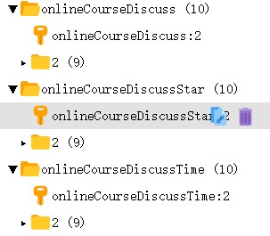
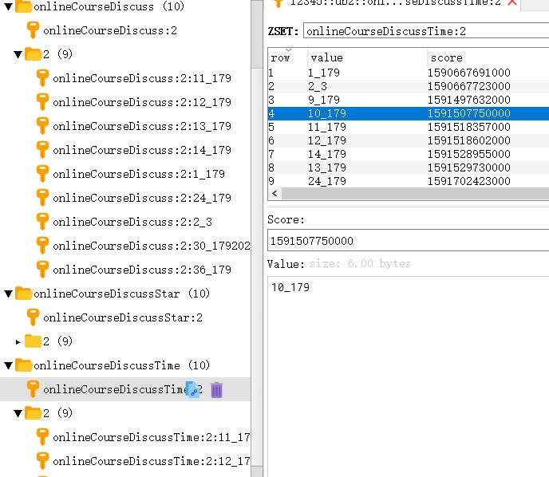
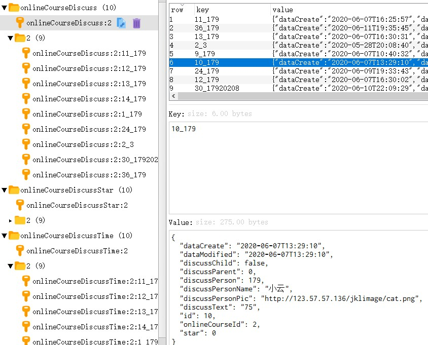
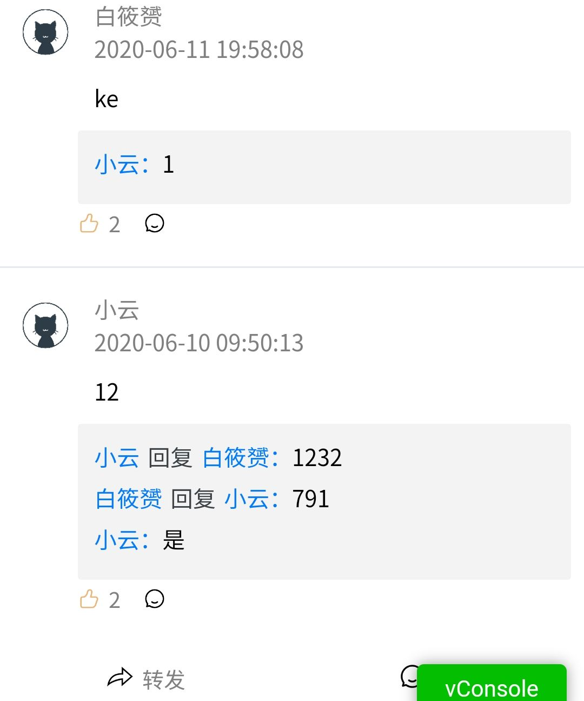
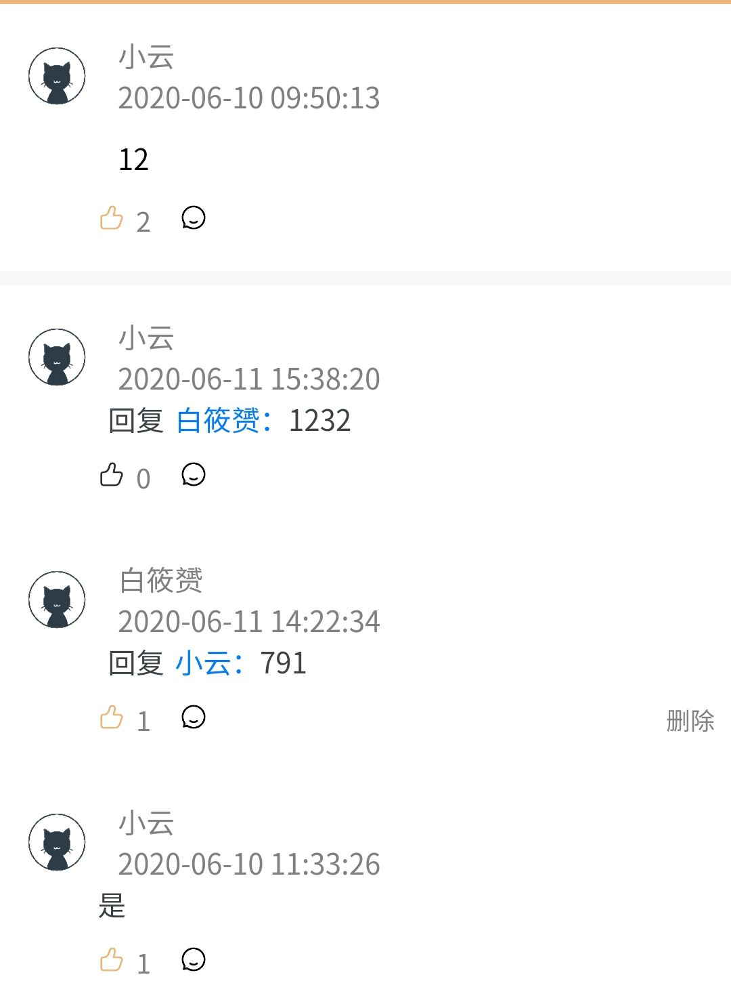
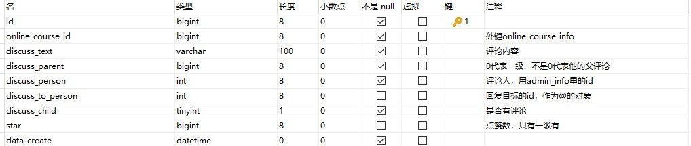

<center>6月17号记：</center>这篇文章我重写了一遍，因为我发现我理解错了。也不能完全说使用List类型来实现评论是错的，只是局限性太大了，只能按添加的顺序排序，而且放到实际业务中完全不行。
而且我一开始List评论的添加顺序也错了，被我写成了右添加，就是最先评论的被放到最后了，有点无语。因为我搞错了方向所以就避开了左添加时List下标被移动所带来的一些问题，虽然我也做了处理。当然这些都不是重点，就是简单的说下我6月2号写下的文章的错误。

## 现在我的实现理解是认为通过ZSet搭配HashMap是最完美的，通过ZSet的排序来规划顺序，再通过hashmap来存储信息便于修改才是理想的答案。

接下来展示我的理解：

<figure>
	<a href="../assets/img/picture/Snipaste_2020-06-17_14-13-06.jpg"></a>
</figure>


总体分为onlineCourseDiscussStar，onlineCourseDiscussTime，onlineCourseDiscuss三个文件夹。2这个数字是数据库中课程的唯一id，内层文件夹的2代表的是具体到这个课程下评论的内部评论信息，是用来实现二级评论的。

onlineCourseStar和onlineCourseTime使用ZSet类型，以onlineCourseTime为例，假如说要实现一个以时间排序的评论，那么key根据自己的业务来设计，我是id+评论的用户。value则是添加评论时的时间戳。通过redis里的zset类型所提供的根据value的排序其实我们就得到了以时间为顺序的一个评论排列。而star也是同理，value是点赞数，来得到一个根据热度排序的评论列表，然后就是根据设计的Key到onlineCourseDiscuss里去取相应的评论。

这样就是把评论和顺序分开了，顺序关顺序，评论内容关评论内容，在代码的实现上看上去多了很多查找的步骤要先查顺序，再查内容。但我觉得实际上在数据的隔离性上强了，而且评论内容onlineCourseDisucss通过HashMap实现，获取对应的评论时间也是0(1)，其次当顺序和评论内容分开后，会发现在修改评论内容上变轻松了，我们只需要拿对应的Key就可以获取或修改相应的内容，不用像使用list一样还要担心评论添加进去后顺序的移动。**至少2020年6月17号的我是认为ZSet搭配HashMap是redis来实现评论的正解**。

再放两张图片便于理解，第一张是代表时间的排序，第二张是这个key在onlineCourseDisucss里所对应评论内容

<figure class="half">
	<a href="../assets/img/picture/Snipaste_2020-06-17_14-30-00.jpg"></a>
	<a href="../assets/img/picture/Snipaste_2020-06-17_14-38-04.jpg"></a>
</figure>

**redis实现评论算是我这段时间里想的比较多的一个功能，也想了很多，从string类型考虑到list类型再到现在的zset搭配hashmap，我只敢说zset搭配hashmap是我目前认为的正解，但不管结果怎么样，至少我在这一个功能里从string一路跑到zset,hashmap类型来写这个评论，从这点上来说收获还不错吧。**

<figure class="half">
	<a href="../assets/img/picture/qq_pic_merged_1592376867002.jpg"></a>
	<a href="../assets/img/picture/qq_pic_merged_1592376899771.jpg"></a>
</figure>

接下来是实现的代码，就简单的写一下，代码也有加注解。因为我觉得这个评论的设计就是一种思想，一种设计的方法，并不用局限到代码上，甚至你要是不用redis就用mysql根本没我这么多事.....其次，你看了我上面的解说，也应该会有点想法吧（？），按自己的写法跟着我的设计思路应该也能实现redis评论。

## 先展示查询评论的代码，便于理解我这整个redis评论设计

```java
//因为整个过程代码比较多，所以通过@Autowired创建的类我都没加进来

private static Lock lock = new ReentrantLock();

private static final Logger logger = LoggerFactory.getLogger(OnlineCourseDiscussServiceImpl.class);

//线程池
private static ExecutorService executor = new ThreadPoolExecutor(2, 7, 2000L, TimeUnit.MILLISECONDS,
          new ArrayBlockingQueue<Runnable>(100), new ThreadFactoryBuilder().setNameFormat("redis-discuss-pool-%d").build(),
          new ThreadPoolExecutor.CallerRunsPolicy());

private static final String MODEL = "star";

public List<OnlineCourseDiscuss> findDiscussByCourseId(Long onlineCourseId, Integer pageStart, Integer pageSize,String model) {
    String key = "onlineCourseDiscuss:" + onlineCourseId;
    String keyTime = "onlineCourseDiscussTime:" + onlineCourseId;
    String keyStar = "onlineCourseDiscussStar:" + onlineCourseId;
    String keyEnd = keyTime;
    //选择排序的模式按time,还是star
    if (MODEL.equals(model)) {
        keyEnd = keyStar;
    }
    //开始得位置
    long start = (pageStart - 1) * pageSize;
    long end = pageStart * pageSize - 1;
    List<OnlineCourseDiscuss> onlineCourseDiscussList = new ArrayList<>();
    if (redisService.sizeSetSort(keyEnd) > start) {
        Set<String> discussTimeList = redisService.reverseRange(keyEnd, start, end);
        //  转换类型
        for (String discussTime : discussTimeList) {
            onlineCourseDiscussList.add(JSON.parseObject(String.valueOf(redisService.getHashValue(key, discussTime)), OnlineCourseDiscuss.class));
        }
        //  第一层遍历
        String finalKeyEnd = keyEnd;
        onlineCourseDiscussList.forEach(onlineCourseDiscuss -> {
            if (onlineCourseDiscuss.getDiscussChild()) {
                StringBuilder stringBuilder = new StringBuilder(":").append(onlineCourseDiscuss.getId()).append("_").append(onlineCourseDiscuss.getDiscussPerson());
                String keyNum = key + stringBuilder.toString();
                String keyNumTime = finalKeyEnd + stringBuilder.toString();
                Set<String> discussSet = redisService.reverseRange(keyNumTime, 0, 5);
                List<OnlineCourseDiscuss> courseDiscusses = new ArrayList<>();
                //  将内层评论取出
                for (String discuss : discussSet) {
                    courseDiscusses.add(JSON.parseObject(String.valueOf(redisService.getHashValue(keyNum, discuss)), OnlineCourseDiscuss.class));
                }
                onlineCourseDiscuss.setOnlineCourseDiscussList(courseDiscusses);
            }
        });
    } else {
        // sql查出的一级评论
        onlineCourseDiscussList = onlineCourseDiscussMapper.findDiscussByCourseId(onlineCourseId, 0L);
        // 提交给线程池执行
        executor.execute(new CourseDiscuss(key, keyTime, keyStar, onlineCourseDiscussList, redisService));
        // 但因为我用的是list类型，而且还要把对象类型转为String，所以只能拆开
        onlineCourseDiscussList.forEach(onlineCourseDiscuss -> {
            if (onlineCourseDiscuss.getDiscussChild()) {
                List<OnlineCourseDiscuss> courseDiscusses = onlineCourseDiscussMapper
                        .findDiscussByCourseId(onlineCourseId, onlineCourseDiscuss.getId());
                StringBuilder stringBuilder = new StringBuilder(":").append(onlineCourseDiscuss.getId()).append("_").append(onlineCourseDiscuss.getDiscussPerson());
                String keyTimeTwo = keyTime + stringBuilder.toString();
                String keyTwo = key + stringBuilder.toString();
                String keyStarTwo = keyStar + stringBuilder.toString();
                executor.execute(new CourseDiscuss(keyTwo,keyTimeTwo,keyStarTwo,courseDiscusses,redisService));
                onlineCourseDiscuss.setOnlineCourseDiscussList(courseDiscusses);
            }
        });
    }
    return onlineCourseDiscussList;
}
//线程的具体执行代码类
private static class CourseDiscuss implements Runnable {

    private String name;
    private String keyTime;
    private String keyStar;
    private List<OnlineCourseDiscuss> onlineCourseDiscussList;
    private IRedisService redisService;

    CourseDiscuss(String name, String keyTime, String keyStar, List<OnlineCourseDiscuss> onlineCourseDiscussList, IRedisService redisService) {
        this.name = name;
        this.keyTime = keyTime;
        this.keyStar = keyStar;
        this.onlineCourseDiscussList = onlineCourseDiscussList;
        this.redisService = redisService;
    }

    @Override
    public void run() {
        onlineCourseDiscussList.forEach(onlineCourseDiscuss -> {
            //将数据添加到redis里相应的地方
            String key = String.valueOf(onlineCourseDiscuss.getId()) + "_" + onlineCourseDiscuss.getDiscussPerson();
            redisService.putHash(name, key, JSON.toJSONString(onlineCourseDiscuss));
            redisService.addSetSort(keyStar,key,onlineCourseDiscuss.getStar());
            redisService.addSetSort(keyTime, key, onlineCourseDiscuss.getDataModified().toInstant(ZoneOffset.of("+8")).toEpochMilli());
        });
    }
}
```

代码有点多，总体上查询就是一开始redis里数据不存在就查数据库，数据库查出后我是一方面把数据给线程池去创建key，另一方面直接返回这个查询结果。redis里数据有，就查redis。

数据库的设计如下，图片里少了一列data_modified,放了一个discuss_child的字段，是用来判断是否有子评论，用于减少二级评论查询的次数，但也因为加了这个字段，所以如果是添加二级评论的话，就要多一个修改父评论的操作。

<figure>
	<a href="../assets/img/picture/Snipaste_2020-06-02_21-54-09.jpg"></a>
</figure>

## 添加评论的代码

```java
//事务注解，用于失败回滚，隔离级别使用可重复读
@Transactional(rollbackFor = Exception.class, isolation = Isolation.REPEATABLE_READ)
@Override
public int insertOnlineCourseDiscuss(OnlineCourseDiscuss onlineCourseDiscuss, Integer discussToPersonId) {
    int result = 0;
    //直接先判断用户id和用户name有没有对上，防止恶意添加评论
    if (onlineCourseDiscussMapper.isExist(onlineCourseDiscuss.getDiscussPerson(), onlineCourseDiscuss.getDiscussPersonName()) > 0) {
        //  先判断是否有回复某一用户，有回复说明必定是二级评论，要先判断是否有parent否则说明不是二级评论，直接返回，是二级评论了才进行判断id和nam是否对上
        boolean bool = (onlineCourseDiscuss.getDiscussToPerson() == null && StringUtils.isEmpty(onlineCourseDiscuss.getDiscussToPersonName())) || (onlineCourseDiscuss.getDiscussParent() != 0 && onlineCourseDiscussMapper
                .isExist(onlineCourseDiscuss.getDiscussToPerson(), onlineCourseDiscuss.getDiscussToPersonName()) > 0);
        if (bool) {
            result = 1;
        }
    }
    if (result == 0) {
        logger.error("某一用户不存在");
        return 0;
    }
    //  外层key
    String key = "onlineCourseDiscuss:" + onlineCourseDiscuss.getOnlineCourseId();
    String keyTime = "onlineCourseDiscussTime:" + onlineCourseDiscuss.getOnlineCourseId();
    String keyStar = "onlineCourseDiscussStar:" + onlineCourseDiscuss.getOnlineCourseId();
    //  判断是否是子评论
    if (onlineCourseDiscuss.getDiscussParent() != 0) {
        //  获取父评论
        String hashKey = onlineCourseDiscuss.getDiscussParent() + "_" + discussToPersonId;
        OnlineCourseDiscuss courseDiscuss = JSON.parseObject(String.valueOf(redisService.getHashValue(key, hashKey)), OnlineCourseDiscuss.class);
        if (courseDiscuss == null) {
            logger.error("无父评论,恶意添加");
            return 0;
        }
        //  判断是否是第一次添加子评论
        StringBuilder stringBuilder = new StringBuilder()
                .append(":").append(courseDiscuss.getId())
                .append("_").append(courseDiscuss.getDiscussPerson());
        //	这个地方如果后面的添加没成功，redis的更新并不会回滚，但不会影响程序的运行就是前面的查询会认为有子评论，但实际上没有。
        //	如果要改的话就是放到锁的地方，一切都已sql添加成功为前提来进行redis的改动
        if (redisService.keys(key + stringBuilder).size() == 0) {
            courseDiscuss.setDiscussChild(true);
            //  是的话将父评论中字段设为有孩子及子评论
            onlineCourseDiscussMapper.updateById(courseDiscuss);
            redisService.putHash(key, hashKey, JSON.toJSONString(courseDiscuss));
        }
        //  评论子Key
        key += stringBuilder;
        keyTime += stringBuilder;
        keyStar += stringBuilder;
    }
    //	加锁，进行同步操作，既要更新数据库还要添加数据到redis相应的地方
    lock.lock();
    try {
        try {
            onlineCourseDiscuss.setDataCreate(LocalDateTime.now());
            onlineCourseDiscuss.setDataModified(LocalDateTime.now());
            result = onlineCourseDiscussMapper.insert(onlineCourseDiscuss);
            String str = onlineCourseDiscuss.getId() + "_" + onlineCourseDiscuss.getDiscussPerson();
            redisService.putHash(key, str, JSON.toJSONString(onlineCourseDiscuss));
            redisService.addSetSort(keyStar,str,onlineCourseDiscuss.getStar());
            redisService.addSetSort(keyTime, str, onlineCourseDiscuss.getDataModified().toInstant(ZoneOffset.of("+8")).toEpochMilli());
        } catch (Exception e) {
            result = 0;
            e.printStackTrace();
        }
    } finally {
        lock.unlock();
    }
    return result;
}
```

总体的设计上是事务注解，隔离级别是可重复度，事务失败回滚。第一步是判断评论用户id和评论用户名称是否对的上，在数据库中id是有外键的所以并不担心不存在的id添加，担心的是评论Id和name对不上，因为我执行添加操作的数据库表name对应的字段是不存在的,而且对name设外键也是没用的的，但redis为了更好的展示是有添加name的所以必须要在第一步对id和name进行一个匹配。如下图

```
int result = 0;
//直接先判断用户id和用户name有没有对上，防止恶意添加评论
if (onlineCourseDiscussMapper.isExist(onlineCourseDiscuss.getDiscussPerson(), onlineCourseDiscuss.getDiscussPersonName()) > 0) {
    //  先判断是否有回复某一用户，有回复说明必定是二级评论，要先判断是否有parent否则说明不是二级评论，直接返回，是二级评论了才进行判断id和nam是否对上
    boolean bool = (onlineCourseDiscuss.getDiscussToPerson() == null && StringUtils.isEmpty(onlineCourseDiscuss.getDiscussToPersonName())) || (onlineCourseDiscuss.getDiscussParent() != 0 && onlineCourseDiscussMapper
            .isExist(onlineCourseDiscuss.getDiscussToPerson(), onlineCourseDiscuss.getDiscussToPersonName()) > 0);
    if (bool) {
        result = 1;
    }
}
if (result == 0) {
    logger.error("某一用户不存在");
    return 0;
}
```

然后再判断是否是一个正确的二级评论回复，因为评论回复必须是一个二级评论。如果我不对评论回复操作进行一个判断的话，我进行一级评论故意带上回复相关的属性的话，我的sql添加是可以成功的，因为流程本就是对的，而且对我的前端展示也不会有影响，但数据库里那一行事实上discuss_to_person字段是有一个数据的。所以如果是评论回复操作的话，就要做一个二级评论判断。

没通过就直接返回。

### 如果是子评论

```java
if (onlineCourseDiscuss.getDiscussParent() != 0) {
    //  获取父评论
    String hashKey = onlineCourseDiscuss.getDiscussParent() + "_" + discussToPersonId;
    OnlineCourseDiscuss courseDiscuss = JSON.parseObject(String.valueOf(redisService.getHashValue(key, hashKey)), OnlineCourseDiscuss.class);
    if (courseDiscuss == null) {
        logger.error("无父评论,恶意添加");
        return 0;
    }
    //  判断是否是第一次添加子评论
    StringBuilder stringBuilder = new StringBuilder()
            .append(":").append(courseDiscuss.getId())
            .append("_").append(courseDiscuss.getDiscussPerson());
    //	这个地方如果后面的添加没成功，redis的更新并不会回滚，但不会影响程序的运行就是前面的查询会认为有子评论，但实际上没有。
    //	如果要改的话就是放到锁的地方，一切都已sql添加成功为前提来进行redis的改动
    if (redisService.keys(key + stringBuilder).size() == 0) {
        courseDiscuss.setDiscussChild(true);
        //  是的话将父评论中字段设为有孩子及子评论
        onlineCourseDiscussMapper.updateById(courseDiscuss);
        redisService.putHash(key, hashKey, JSON.toJSONString(courseDiscuss));
    }
    //  评论子Key
    key += stringBuilder;
    keyTime += stringBuilder;
    keyStar += stringBuilder;
}
```

首先要先拿父评论，判断我要评论的这个一级评论是否是真正的我要评论的对象，又或者根本就不存在父评论，这是我担心有人直接用类似postman这样的软件用url带参数的方式来直接访问接口，参数乱带，根本没父评论也能添加进去。

然后进行一个判断是否是第一次添加子评论，对discussChild字段进行修改，告诉父评论你是有子评论的。然后进行一个Key拼接，生成二级评论对应的redis里的key

### 添加评论

```java
lock.lock();
try {
    try {
        onlineCourseDiscuss.setDataCreate(LocalDateTime.now());
        onlineCourseDiscuss.setDataModified(LocalDateTime.now());
        result = onlineCourseDiscussMapper.insert(onlineCourseDiscuss);
        String str = onlineCourseDiscuss.getId() + "_" + onlineCourseDiscuss.getDiscussPerson();
        redisService.putHash(key, str, JSON.toJSONString(onlineCourseDiscuss));
        redisService.addSetSort(keyStar,str,onlineCourseDiscuss.getStar());
        redisService.addSetSort(keyTime, str, onlineCourseDiscuss.getDataModified().toInstant(ZoneOffset.of("+8")).toEpochMilli());
    } catch (Exception e) {
        result = 0;
        e.printStackTrace();
    }
} finally {
    lock.unlock();
}
```

因为是评论添加肯定要考虑到高并发情况下的添加，我自己用jmeter测试了下，结果和预期一样。用的是比较熟悉的的ReentrantLock做锁，并不打算锁整个方法降效率，我也只需要保证redis和mysql一起添加，让顺序不要出现问题就可以了。
