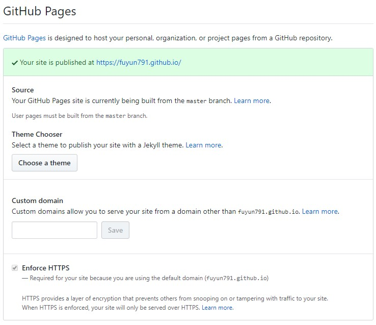
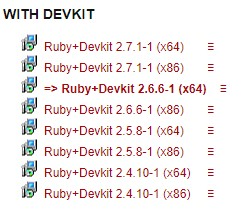
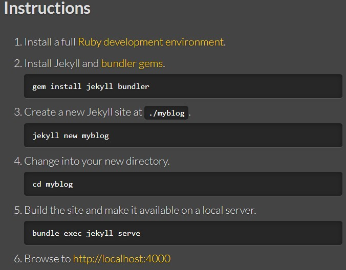
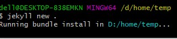
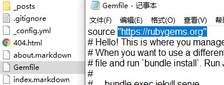
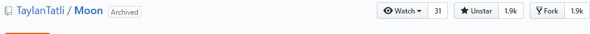

我使用的模板是[Moon Jekyll Theme](https://taylantatli.github.io/Moon/moon-theme/)这篇记录了其的使用方法，和模板作者的GitHub网址.

一开始上手我的建议是先不要使用模板，先自己走一遍jekyll的一个小例子.整个过程并不复杂，但是在下载ruby于其使用下载相应文件的过程因为是访问外网所以很慢.

## 文中涉及资料：

* [单纯的GitHub快速使用](https://pages.github.com/) 和 [GitHub Pageit文档](https://help.github.com/en/github/working-with-github-pages/creating-a-github-pages-site-with-jekyll)
* [RubyInstaller](https://rubyinstaller.org/downloads/)windows下这个
* [jekyll文档](https://jekyllrb.com/docs/)
* [jekyll的一些模板](https://jamstackthemes.dev/ssg/jekyll/)

## 文章目录：

1. 使用GitHub Page
2. 准备Jekyll的使用环境
3. 使用Jekyll+GitHub Page
4. 使用模板

## 使用GitHub Page：

如果你并不打算使用Jekyll，打开上面的[单纯的GitHub快速使用](https://pages.github.com/)根据里面的步骤走相信我，你已经能完成创建一个自己的博客了。

需要注意的是Repository name里的前半部分一定要和你的github账号名对上，而且是不区分大小写的。例如说我的Fuyun791使用的就是fuyun791。

<figure>
	
</figure>

点击**Choose a theme**然后再选一个github提供的一些模板，博客就完成了。

## 准备Jekyll的使用环境：

如果你是windows的话直接点击[RubyInstaller](https://rubyinstaller.org/downloads/)，如果不是的话也没关系，这个就是ruby的官网点download找你相对应的系统即可。

<figure>
	
</figure>

2.6.1是最新的稳定版，网址中右边会有一大串英文也是希望我们下载稳定版。这个下载的过程会很慢，请耐心等待。

安装过程很平常，路径根据喜好修改，安装完后会有一个ridk install的过程，会出现终端，我的是自动弹出的，大体的意思是安装环境，我选了3，选1也行。

然后运行 **gem install jekyll bundler**，如下图，你会发现下不过来,请看图二，修改gem的源。

<figure>
	
</figure>

    
        gem sources //先执行这条查看当前的gem源
        gem -remove https://rubygems.org/
        gem -a https://gems.ruby-china.com
        gem sources //再看当前源是否被修改
    

然后再下载即可成功，当你使用`jekyll new .` (`.`代表当前路径，如果是myblog的话就是创建一个myblog文件夹在创建。)你会发现你又卡住了，下不过来

<figure>
	
</figure>

仔细观察上图会发现被卡在了bundle install的地方，然后再看文件夹会发现文件已经有了。

<figure>
	
</figure>

将上图的地址改成https://gems.ruby-china.com再手动运行bundle install即可。然后按着图一走既完成jekyll的小例子。

## 使用Jekyll+GitHub Page：

将上面完成的项目传到GitHub上去，注意Repository name即可使用。

## 使用模板：

[jekyll的一些模板](https://jamstackthemes.dev/ssg/jekyll/)从这里面找自己喜欢的模板，使用时请注意使用许可等方面的内容。

然后到github，如下图，先点star再fork(这一步我觉得fork会更好，不然就是自己clone再提交到github上去)

<figure>
	
</figure>

然后简单的说下jekyll的结构,可看这篇[jekyll配置与模板语法](https://gist.github.com/biezhi/f88be58ef4ae0f3741bb36ab8daa53c5)：

1. _posts是文章发布的地方，文件名必须遵循 `2020-04-17-XXX`这样的模式。
2. _drafts是放一些例如文章写到一半，还没写好，我不想让别人看，就放这。
3. _includes与_layouts是编写的页面代码，如果用的是别人的模板就按自己的需求进行修改即可。
4. 需要注意修改的是 `_config.yml` 这里放的是这个博客的全局信息，需要将其改成自己的，属性对应就不详说，看到了大概就能明白意思了。
5. 在Moon这个模板中想图片，css，js是存放在assets文件夹中，自行修改。

最后放上我修改后自己博客的截图：

<figure>
	
</figure>
